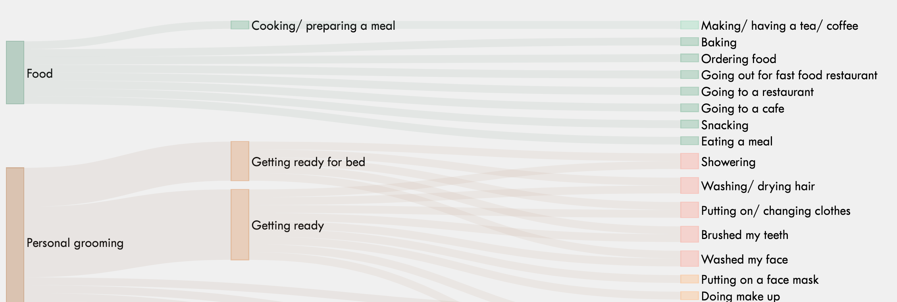

---
output:
  md_document:
    variant: markdown_github
---

# Visualization of the Categories/ Codebook

Part of the project "Assessing Daily Life Activities: Comparing Predefined Categories with the Qualitative Analysis of Open-Ended Responses in Experience Sampling Methodology (ESM)" Marie Stadel, Anna Langener, Laura Bringmann

Sankey Diagram is based on: <https://gist.github.com/d3noob/013054e8d7807dff76247b81b0e29030>

In this repository we provide example code to visualize the categories/ codebook as a Sankey Diagramm:

{width="567"}

## How to get data into the right structure for visualization?

### 1) Required data files to create the visualization

To visualize the data, we need two files. The first file should contain an overview of all unique codes and their corresponding level. The columns should be named "Code" and "Level".

```{r echo=TRUE}
Overview_Codes <- read.csv("/Users/annalangener/projects/QualitativeVis/Overview_Codes.csv")
head(Overview_Codes)
```

The second data file contains how the different codes are related to each other. It contains a column called "source" and a column called "target". For example, our first "source" code is *Food*, which has the subcode ("target") *cooking/ preparing a meal*.

```{r echo=TRUE}
Source_Target <- read.csv("/Users/annalangener/projects/QualitativeVis/Source_Target.csv")
head(Source_Target)
```

### 2) Merge both files

The next step is to merge the two data files. We create two new columns that contain the level of the "source" and "target" code. We need this for the data visualization to have the codes in the right place (all level 4 codes on the left and so on).

```{r message=FALSE, warning=FALSE}
library(dplyr)

source = data.frame(level_source = Overview_Codes$Level,Code = Overview_Codes$Code )
target = data.frame(level_target = Overview_Codes$Level,Code = Overview_Codes$Code )

Source_Target <- left_join(Source_Target, source, by = c("source" = "Code"))
Source_Target <- left_join(Source_Target, target, by = c("target" = "Code"))

Source_Target
```

### 4) Add the "value" column

To visualize the data correctly, we need to add another column called "value". This column shows the thickness of the lines between the codes.

```{r}
target_counts <- Source_Target %>%
  group_by(source) %>%
  summarize(value = n())

Source_Target <- left_join(Source_Target, target_counts, by = c("target" = "source"))

Source_Target$value[is.na(Source_Target$value)] = 1

```

Most of our value entries are now correctly. For some codes (that have multiple subcodes), we need to make some additional small adjustments.

```{r}
# Fix the value for multiple levels
checkcol <- Source_Target$source[Source_Target$value != 1]

for (i in 1:length(checkcol)) {
  targets <- Source_Target$target[Source_Target$source == checkcol[i]]
  for (j in 1:length(targets)) {
    tragets_lowerlevel <-
      Source_Target$target[Source_Target$source %in% targets[j]]
    for (k in 1:length(tragets_lowerlevel)) {
      value <-
        nrow(Source_Target[Source_Target$source %in% tragets_lowerlevel[k], ]) + 1
      if (value > 1) {
        Source_Target$value[Source_Target$source == checkcol[i] &
                              Source_Target$targe == targets[j]] <- value
      }
    }
  }
}

# Correct transport case (two sources go to one target)
target_counts <- Source_Target %>%
  group_by(target) %>%
  summarize(value = n())

index <- left_join(Source_Target, target_counts, by = c("target" = "target"))
index <- index[index$value.y != 1,]
index <- index[index$value.x != 1,]

index_source <- index$source
index_source <- Source_Target[Source_Target$target %in% index_source,]

index <- index[duplicated(index$target),]

for(i in 1:nrow(index)){
Source_Target$value[ Source_Target$target == index$target[i]] =
  Source_Target$value[ Source_Target$target == index$target[i]]/index$value.y[i]
}

# fix other mistake
for(i in 1:nrow(index_source)){
Source_Target$value[Source_Target$target %in% index_source] = Source_Target$value[index_source$target[i] == Source_Target$source]
}
```

### 5) Save the file

Finally, we need to save our file. This file will be used for the data visualization.

```{r echo=TRUE}
write.csv(Source_Target,"/Users/annalangener/projects/QualitativeVis/TestFormatVis_new.csv")

head(Source_Target)
```

### 6) Manual adjustment

If the visualization has some overlapping codes, it may help to move the order of the codes around in the data file.
